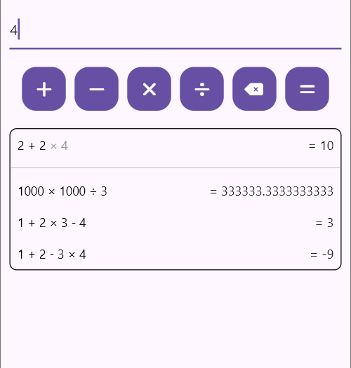

# calculator_flutter

A simple Flutter project that can evaluate arithmetic equations.

## Features

- An injection-safe number box that limits you to only certain types of characters and patterns
- Chaining of operations
- Backspace to fix your mistakes
- Expression evaluation using the order of operations
- Storage of past calculations

## Demo

